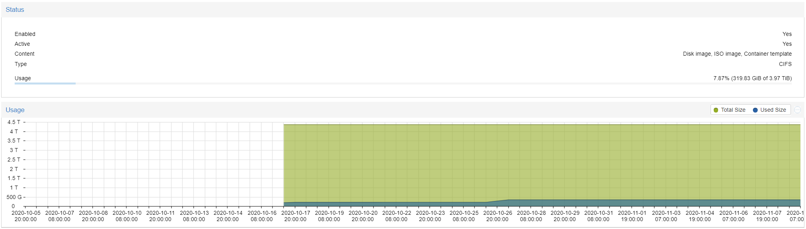
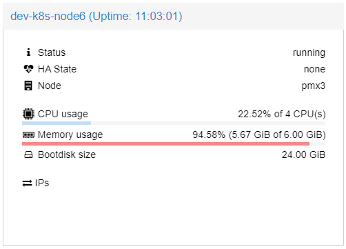
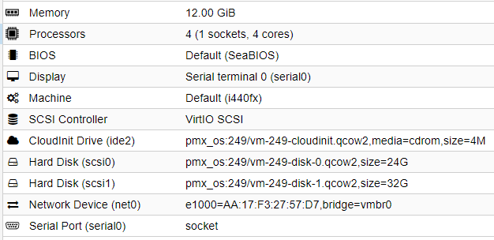

# RKE Thoughts and Learnings

Here's what I learned about getting RKE up and going, managing it, and how everything is operating so far.

## Hypervisor Resources

### Storage

#### OS / FAST Storage (3x M.2 Crucial SSD)


#### Data / Slow Storage (3x 5900RPM WD HDD)



### Virtual machines

The VM's are split between three hypervisors.

- 1Gbps Cat 6 Ethernet for Data/Communication between services
- 10Gbps Multimode Fiber for their storage networking, or SAN.

Each VM was assigned a small boot volume, and a secondary **UNFORMATTED** disk for CEPH usage from inside the Kubernetes cluster.

Total Compute Resource allocation is currently at:

```yaml
CPU: 26
Memory: "68GiB"
```

#### VM 1 - dev-k8s-node1

Resources allocated:

```yaml
CPU: 2
Memory: "6GiB"
Boot_Disk_Size: "24 GiB"
CEPH_Disk_Size: "20 GiB"
```

##### **Node 1 Summary**


##### **Node 1 Hardware**


#### VM 2 - dev-k8s-node2

Resources allocated:

```yaml
CPU: 2
Memory: "6GiB"
Boot_Disk_Size: "24 GiB"
CEPH_Disk_Size: "20 GiB"
```

##### **Node 2 Summary**


##### **Node 2 Hardware**


#### VM 3 - dev-k8s-node3

Resources allocated:

```yaml
CPU: 2
Memory: "6GiB"
Boot_Disk_Size: "24 GiB"
CEPH_Disk_Size: "20 GiB"
```

##### **Node 3 Summary**


##### **Node 3 Hardware**


#### VM 4 - dev-k8s-node4

Resources allocated:

```yaml
CPU: 2
Memory: "6GiB"
Boot_Disk_Size: "24 GiB"
CEPH_Disk_Size: "20 GiB"
```

##### **Node 4 Summary**


##### **Node 4 Hardware**


#### VM 5 - dev-k8s-node5

Resources allocated:

```yaml
CPU: 2
Memory: "8GiB"
Boot_Disk_Size: "24 GiB"
CEPH_Disk_Size: "20 GiB"
```

##### **Node 5 Summary**


##### **Node 5 Hardware**


#### VM 6 - dev-k8s-node6

Resources allocated:

```yaml
CPU: 4
Memory: "6GiB"
Boot_Disk_Size: "24 GiB"
CEPH_Disk_Size: "32 GiB"
```

##### **Node 6 Summary**



##### **Node 6 Hardware**


#### VM 7 - dev-k8s-node7

Resources allocated:

```yaml
CPU: 4
Memory: "8GiB"
Boot_Disk_Size: "24 GiB"
CEPH_Disk_Size: "32 GiB"
```

##### **Node 7 Summary**


##### **Node 7 Hardware**


#### VM 8 - dev-k8s-node8

Resources allocated:

```yaml
CPU: 4
Memory: "8GiB"
Boot_Disk_Size: "24 GiB"
CEPH_Disk_Size: "32 GiB"
```

##### **Node 8 Summary**


##### **Node 8 Hardware**


#### VM 9 - dev-k8s-node9

Resources allocated:

```yaml
CPU: 4
Memory: "12GiB"
Boot_Disk_Size: "24 GiB"
CEPH_Disk_Size: "32 GiB"
```

##### **Node 9 Summary**


##### **Node 9 Hardware**



## Kubernetes Cluster

The Kubernetes Cluster was created using RKE. The Config file is attached in this repo [here](cluster.yml).

### Overview


### Nodes


### Workloads


### Storage Information

#### Rook Storage Class


#### Persistent Volumes


#### Persistent Volume Claims


## Deploying RKE

Deploying RKE is perhaps the easiest way I've ever deployed Kubernetes, even compared to AWS EKS.

Once you download the [RKE binary](https://github.com/rancher/rke/releases/tag/v1.1.11), it really is as simple as building your '[cluster.yml](cluster.yml)' file and running `rke up`. This did take some time to complete, so be patient.

## Configuring Rook-Ceph on RKE

The Rook-Ceph Cluster was deployed using the [TL;DR](https://github.com/rook/rook/blob/master/Documentation/ceph-quickstart.md#tldr) method found in their quickstart documentation page. While it did take nearly ~10m to properly provision, it completed quite successfully.

The StorageClass was added directly from [here](https://raw.githubusercontent.com/rook/rook/master/cluster/examples/kubernetes/ceph/csi/rbd/storageclass.yaml) with the following command:

```bash
git clone --single-branch --branch v1.4.7 https://github.com/rook/rook.git
cd rook/cluster/examples/kubernetes/ceph
kubectl create -f common.yaml
kubectl create -f operator.yaml
kubectl create -f cluster.yaml
```

The only modification was patching on the default storage class information with the following command:

```bash
kubectl patch storageclasses.storage.k8s.io rook-ceph-block -p '{"metadata": {"annotations":{"storageclass.kubernetes.io/is-default-class":"true"}}}'
```

### Rook Ceph `lsblk` on Host

When running `lsblk` on each of the nodes, we can see the following information:

```bash
➜ for i in 10.45.0.24{1..9}; do ssh ubuntu@$i -t 'lsblk' ; done

# Host 1
NAME    MAJ:MIN RM  SIZE RO TYPE MOUNTPOINT
sda       8:0    0   24G  0 disk
├─sda1    8:1    0 23.9G  0 part /
├─sda14   8:14   0    4M  0 part
└─sda15   8:15   0  106M  0 part /boot/efi
sdb       8:16   0   20G  0 disk
sr0      11:0    1    4M  0 rom
Connection to 10.45.0.241 closed.

# Host 2
NAME    MAJ:MIN RM  SIZE RO TYPE MOUNTPOINT
sda       8:0    0   24G  0 disk
├─sda1    8:1    0 23.9G  0 part /
├─sda14   8:14   0    4M  0 part
└─sda15   8:15   0  106M  0 part /boot/efi
sdb       8:16   0   20G  0 disk
sr0      11:0    1    4M  0 rom
Connection to 10.45.0.242 closed.

# Host 3
NAME                                                                                                 MAJ:MIN RM  SIZE RO TYPE MOUNTPOINT
sda                                                                                                    8:0    0   24G  0 disk
├─sda1                                                                                                 8:1    0 23.9G  0 part /
├─sda14                                                                                                8:14   0    4M  0 part
└─sda15                                                                                                8:15   0  106M  0 part /boot/efi
sdb                                                                                                    8:16   0   20G  0 disk
└─ceph--b43956e7--0b23--47d4--bb82--773c7ead59fa-osd--data--bade6348--b448--4433--b106--37ecec069789 253:0    0   20G  0 lvm
sr0                                                                                                   11:0    1    4M  0 rom
Connection to 10.45.0.243 closed.

# Host 4
NAME                                                                                                 MAJ:MIN RM  SIZE RO TYPE MOUNTPOINT
sda                                                                                                    8:0    0   24G  0 disk
├─sda1                                                                                                 8:1    0 23.9G  0 part /
├─sda14                                                                                                8:14   0    4M  0 part
└─sda15                                                                                                8:15   0  106M  0 part /boot/efi
sdb                                                                                                    8:16   0   20G  0 disk
└─ceph--9d94eb50--0e2c--4b2d--9e0d--32f12910d845-osd--data--e06b17ed--f7ac--4dc9--b279--50c160b2fc87 253:0    0   20G  0 lvm
sr0                                                                                                   11:0    1    4M  0 rom
Connection to 10.45.0.244 closed.

# Host 5
NAME                                            MAJ:MIN RM  SIZE RO TYPE MOUNTPOINT
sda                                               8:0    0   24G  0 disk
├─sda1                                            8:1    0 23.9G  0 part /
├─sda14                                           8:14   0    4M  0 part
└─sda15                                           8:15   0  106M  0 part /boot/efi
sdb                                               8:16   0   20G  0 disk
└─ceph--613022c3--97d4--4ac1--b8a3--7ca09e7c6eb5-osd--data--ac04b3a9--6d58--4470--9129--48a572f741ca
                                                253:0    0   20G  0 lvm
sr0                                              11:0    1    4M  0 rom
rbd0                                            252:0    0    8G  0 disk /var/lib/kubelet/pods/bfccb6a1-0925-4534-91e0-7a3c0022838c/volumes/kubernetes.io~csi/pvc-8c88946b-4841-4413-9317-e22e7f63d4d8/mount
Connection to 10.45.0.245 closed.

# Host 6
NAME                                            MAJ:MIN RM  SIZE RO TYPE MOUNTPOINT
sda                                               8:0    0   24G  0 disk
├─sda1                                            8:1    0 23.9G  0 part /
├─sda14                                           8:14   0    4M  0 part
└─sda15                                           8:15   0  106M  0 part /boot/efi
sdb                                               8:16   0   32G  0 disk
└─ceph--319f265a--1373--42b1--bd15--1682cf40b8e0-osd--data--73f373da--b4a1--44aa--a85b--721d00ed09b4
                                                253:0    0   32G  0 lvm
sr0                                              11:0    1    4M  0 rom
rbd0                                            252:0    0   50G  0 disk /var/lib/kubelet/pods/a23fc556-8996-4d3c-a69d-234e02bffb2d/volumes/kubernetes.io~csi/pvc-f39c0c92-fda5-4368-82e4-3cb65a19a942/mount
rbd1                                            252:16   0    8G  0 disk /var/lib/kubelet/pods/23ec8d13-dfd1-47da-b9df-34e20ce5a251/volumes/kubernetes.io~csi/pvc-48f63133-ab2e-48ec-a505-d2741e9d264a/mount
Connection to 10.45.0.246 closed.

# Host 7
NAME                                            MAJ:MIN RM  SIZE RO TYPE MOUNTPOINT
sda                                               8:0    0   24G  0 disk
├─sda1                                            8:1    0 23.9G  0 part /
├─sda14                                           8:14   0    4M  0 part
└─sda15                                           8:15   0  106M  0 part /boot/efi
sdb                                               8:16   0   32G  0 disk
└─ceph--8542c8b3--6a3f--45a4--b8a3--2fd6aab9ebfd-osd--data--d86a620b--60fe--43bd--a21f--1f3b5bbb5ad8
                                                253:0    0   32G  0 lvm
sr0                                              11:0    1    4M  0 rom
rbd0                                            252:0    0    8G  0 disk /var/lib/kubelet/pods/0285971a-69b9-4638-a319-77a9d0f6d06f/volumes/kubernetes.io~csi/pvc-ba6db505-355a-47e6-8119-cd1e8aade50e/mount
rbd1                                            252:16   0    1G  0 disk /var/lib/kubelet/pods/1ed33101-e2bf-4cc9-914a-1ddccac3541d/volumes/kubernetes.io~csi/pvc-c0470d3f-793a-48c4-9756-30fe023f96d9/mount
Connection to 10.45.0.247 closed.

# Host 8
NAME                                            MAJ:MIN RM  SIZE RO TYPE MOUNTPOINT
sda                                               8:0    0   24G  0 disk
├─sda1                                            8:1    0 23.9G  0 part /
├─sda14                                           8:14   0    4M  0 part
└─sda15                                           8:15   0  106M  0 part /boot/efi
sdb                                               8:16   0   32G  0 disk
└─ceph--9b1c43ca--a912--46dc--a817--73204783e802-osd--data--f644812d--80cd--4b62--a762--a96186b69e0f
                                                253:0    0   32G  0 lvm
sr0                                              11:0    1    4M  0 rom
rbd0                                            252:0    0    8G  0 disk /var/lib/kubelet/pods/560b184f-da4e-422f-b9c8-ee8668c7e24f/volumes/kubernetes.io~csi/pvc-e663f792-6d4d-4291-842c-fccaf5af15c2/mount
Connection to 10.45.0.248 closed.

# Host 9
NAME                                            MAJ:MIN RM  SIZE RO TYPE MOUNTPOINT
sda                                               8:0    0   24G  0 disk
├─sda1                                            8:1    0 23.9G  0 part /
├─sda14                                           8:14   0    4M  0 part
└─sda15                                           8:15   0  106M  0 part /boot/efi
sdb                                               8:16   0   32G  0 disk
└─ceph--63807421--0ca3--488a--acb8--98095ade01aa-osd--data--08593432--b7b9--4c49--8f46--8c41318ab6cd
                                                253:0    0   32G  0 lvm
sr0                                              11:0    1    4M  0 rom
```

## MetalLB Config with Mikrotik

For communication with the rest of my homelab, I decided to run [MetalLB](https://metallb.universe.tf/) as I have done previously.

This was added by running the following commands:

```bash
kubectl apply -f https://raw.githubusercontent.com/metallb/metallb/v0.9.5/manifests/namespace.yaml
kubectl apply -f https://raw.githubusercontent.com/metallb/metallb/v0.9.5/manifests/metallb.yaml

# On first install only
kubectl create secret generic -n metallb-system memberlist --from-literal=secretkey="$(openssl rand -base64 128)"
```

Additionally, I needed to create the config file manually for configuration with my Mikrotik router.

The config file looks like this:

```yaml
apiVersion: v1
kind: ConfigMap
metadata:
  namespace: metallb-system
  name: config
data:
  config: |
    peers:
    - peer-address: 10.45.0.1
      peer-asn: 65530
      my-asn: 65531
    address-pools:
    - name: default
      protocol: bgp
      addresses:
      - 10.55.0.10-10.55.255.254
```

Only changes necessary on the Mikrotik side of things fro BGP routing between the nodes were simple configuration to enable the network and adding the peers. The raw config looks like this:

```python
/routing bgp network
add comment="Kubernetes BGP" network=10.55.0.0/16
/routing bgp peer
add name=dev-k8s-node01 remote-address=10.45.0.241 remote-as=65531 ttl=default update-source=bridge1
add name=dev-k8s-node02 remote-address=10.45.0.242 remote-as=65531 ttl=default update-source=bridge1
add name=dev-k8s-node03 remote-address=10.45.0.243 remote-as=65531 ttl=default update-source=bridge1
add name=dev-k8s-node04 remote-address=10.45.0.244 remote-as=65531 ttl=default update-source=bridge1
add name=dev-k8s-node05 remote-address=10.45.0.245 remote-as=65531 ttl=default update-source=bridge1
add name=dev-k8s-node06 remote-address=10.45.0.246 remote-as=65531 ttl=default update-source=bridge1
add name=dev-k8s-node07 remote-address=10.45.0.247 remote-as=65531 ttl=default update-source=bridge1
add name=dev-k8s-node08 remote-address=10.45.0.248 remote-as=65531 ttl=default update-source=bridge1
add name=dev-k8s-node09 remote-address=10.45.0.249 remote-as=65531 ttl=default update-source=bridge1
```

When it's all functional, the Web UI should look like this:


